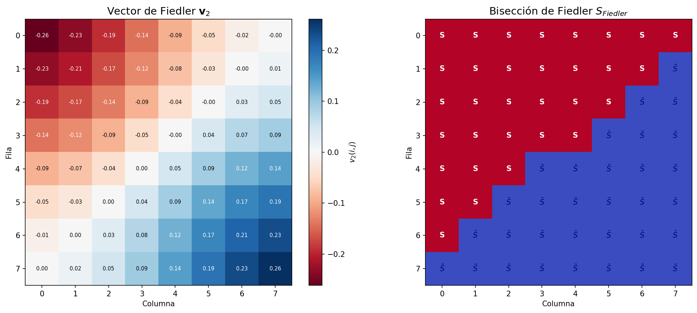
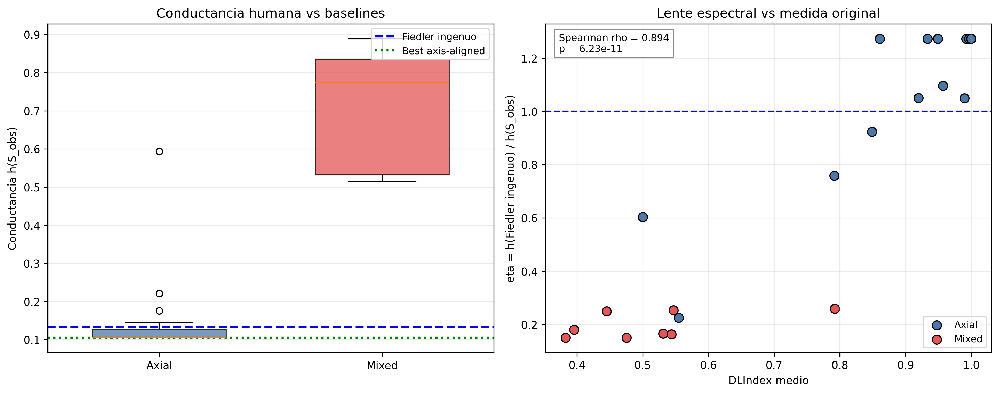
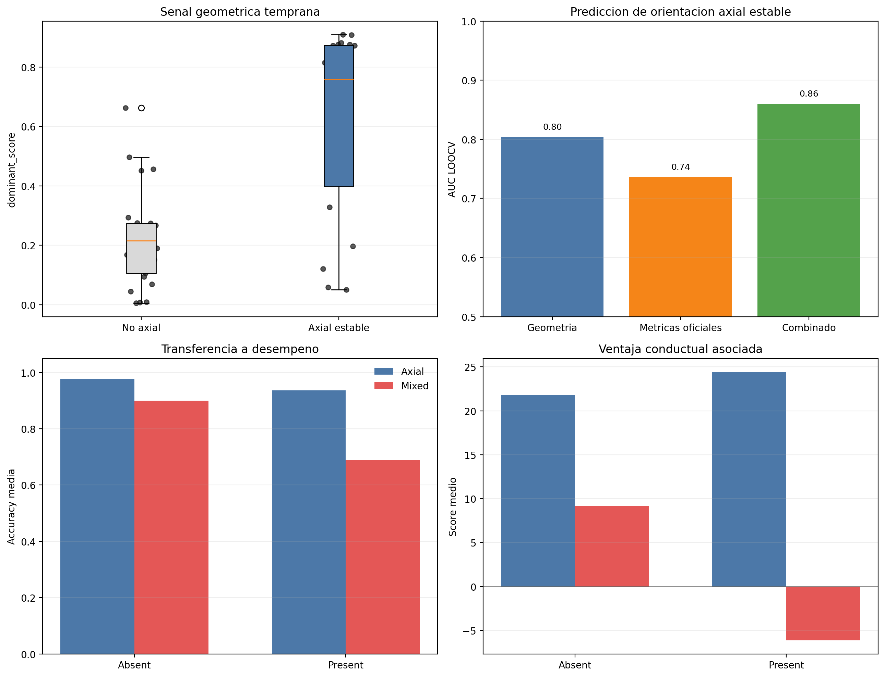

# Symmetry-Aware Spectral Reanalysis of *Seeking the Unicorn*

This repository contains a reproducible graph-theoretic reanalysis of the
*Seeking the Unicorn* / Self-Organized Division of Cognitive Labor (SODCL)
experiment. The board is modeled as the strong product graph
`P_8 boxtimes P_8`, and observed human search patterns are compared against
spectral and axis-aligned references.

The central claim is deliberately narrow: the square board has a degenerate
Fiedler eigenspace, and stable human left-right / top-bottom divisions can be
understood as axial symmetry breaking inside that geometry. The project does
not claim that humans globally optimize conductance, nor that conductance
replaces the behavioral metrics from the original SODCL study.

## Visual Overview

| Spectral geometry | Result summary | Early prediction |
| --- | --- | --- |
|  |  |  |

## Resumen en espanol

Este repositorio reanaliza *Seeking the Unicorn* desde teoria espectral de
grafos. El tablero se modela como `P_8 boxtimes P_8`; por la simetria cuadrada,
el segundo autovalor del Laplaciano aparece degenerado
(`lambda_2 = lambda_3 approx 0.4164`). Esa degeneracion hace que un unico vector
de Fiedler no sea una referencia canonica. Por eso el proyecto compara las
particiones humanas contra referencias sensibles a la simetria y estudia si una
senal geometrica temprana anticipa la especializacion axial posterior.

## Main Results

- The board graph has 64 vertices and 210 edges.
- The Fiedler eigenspace is two-dimensional:
  `lambda_2 = lambda_3 approx 0.4164`.
- The naive Fiedler cut has conductance `28/210 = 0.1333`.
- The axial left-right and top-bottom references have conductance
  `22/210 = 0.1048` within the evaluated axis-aligned family.
- In the primary late-window set (`n = 29`), axial dyads have substantially
  lower observed conductance than mixed dyads:
  `h_obs = 0.142` vs. `0.714`.
- Informational metrics point in the same direction:
  `MI = 0.839` vs. `0.260`, and `JSD = 0.842` vs. `0.284`.
- An early geometric signal computed from the first five shared absent rounds
  predicts later axial specialization with `AUC_LOOCV = 0.804`.
- Combining that early geometric signal with official early behavioral metrics
  gives `AUC_LOOCV = 0.860`.

## Project Scope

This repository contains my reproducible implementation of the spectral
reanalysis: analysis code, public source data, generated result tables, figures,
and methodological documentation.

It is not the original experimental repository and does not claim ownership over
the SODCL experiment or dataset. The contribution here is the graph-theoretic
reanalysis and its reproducible computational artifacts.

## Repository Structure

```text
.
├── data/
│   ├── raw/          # Official SODCL source tables used in this reanalysis
│   └── results/      # Reproducible CSV/NPZ outputs
├── docs/             # Methodological notes and result summaries
├── figures/          # Generated figures used in the paper
├── scripts/          # Non-interactive pipeline entrypoints
├── src/              # Analysis scripts
├── Makefile          # Reproducible command shortcuts
├── requirements.txt  # Python dependencies
└── run.sh            # Interactive runner
```

## Installation

Use Python 3.10 or newer.

```bash
python3 -m venv .venv
source .venv/bin/activate
pip install -r requirements.txt
```

For the paper build, install a LaTeX distribution with `latexmk` and `pdflatex`
available. On macOS, BasicTeX or MacTeX both work if the required packages are
installed.

## Reproducibility

Run the complete analysis pipeline:

```bash
make pipeline
```

Run the default reproducible target:

```bash
make all
```

The non-interactive pipeline is also available directly:

```bash
./scripts/run_all.sh
```

The interactive runner is:

```bash
./run.sh
```

## Generated Outputs

Important result tables:

- `data/results/spectral_comparison_results.csv`
- `data/results/spectral_analysis_audit.csv`
- `data/results/partition_stability_summary.csv`
- `data/results/entropy_analysis_results.csv`
- `data/results/early_prediction_features.csv`
- `data/results/early_prediction_summary.csv`
- `data/results/performance_transfer_summary.csv`
- `data/results/present_performance_increment.csv`

Important figures:

- `figures/fiedler_grid.png`
- `figures/spectral_comparison_summary.png`
- `figures/entropy_analysis.png`
- `figures/temporal_dynamics.png`
- `figures/counterexample_P6xP8.png`
- `figures/partition_robustness_summary.png`
- `figures/early_prediction_summary.png`

Additional documentation:

- [`docs/REPRODUCIBILITY.md`](docs/REPRODUCIBILITY.md)
- [`docs/RESULTS_SUMMARY.md`](docs/RESULTS_SUMMARY.md)
- [`docs/METHODOLOGY_NOTES.md`](docs/METHODOLOGY_NOTES.md)

## Data Source

The raw datasets come from the public SODCL materials:

- Official repository: <https://github.com/EAndrade-Lotero/SODCL>
- Protocol: <https://www.protocols.io/view/seeking-the-unicorn-8epv5zbdnv1b/v1>

The analysis uses:

- `data/raw/humans_only_absent.csv` for graph partitions, conductance,
  informational metrics, stability, and early geometry.
- `data/raw/performances.csv` only for the descriptive transfer to behavioral
  performance.

## Methodological Boundaries

This project should be read as a careful reanalysis, not as a causal experiment.

- The graph model captures axial left-right and top-bottom specialization well.
- It does not fully explain `ALL`, `NOTHING`, `RS`, or other non-bipartite
  strategies.
- Late conductance is strongly correlated with the original `DLIndex` measure
  and should not be presented as a replacement.
- The early geometry signal is the main additional contribution because it is
  interpretable, symmetry-aware, and computed before stable specialization is
  fully established.

## Suggested Citation

Chisica, T. (2026). *Symmetry-Aware Spectral Reanalysis of Seeking the Unicorn*.
Portfolio implementation and reproducible analysis repository.
